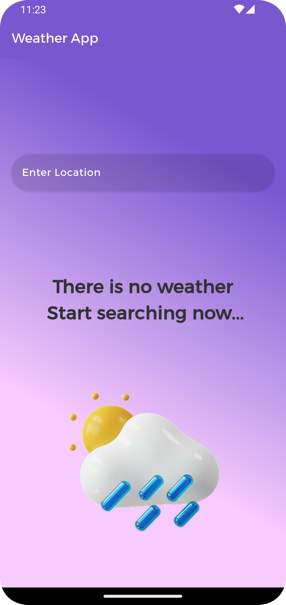

# weather_app

🌦️ Weather App

This application is a modern weather forecast app built using Flutter.
It allows users to search for any city and instantly view the current weather conditions in a beautifully designed and responsive interface.

## 📸 Screenshots

✅ Features

Real-time Weather Data: Displays up-to-date weather information based on the selected city.
City name
Current temperature
Weather condition (e.g. sunny, cloudy)
Max & min temperature
Last updated time
Custom UI: The app features a custom user interface with weather-themed illustrations for an engaging user experience.
Weather Mood Gradient: A dynamic gradient background changes based on the weather condition (e.g., sunny, rainy).
Animations: Smooth animations are incorporated, including animated transitions when navigating between screens and animated weather icons.
Search Functionality: Allows users to search for the weather of any location by entering the city name.
Responsive Design: The app's interface adapts seamlessly to different screen sizes, ensuring an optimal experience across devices.

🛠️ Technologies Used:

Flutter: For building a cross-platform mobile user interface.
Cubit (Bloc State Management): To manage state changes efficiently and ensure smooth updates in the app.
OpenWeatherMap API (or your API of choice): For fetching live weather data.
Dart: The core programming language used with Flutter.
Custom Widgets: For reusable UI components that help maintain cleaner and more manageable code.
Animation: Flutter's built-in animation capabilities to add dynamic effects throughout the app for better user interaction.
